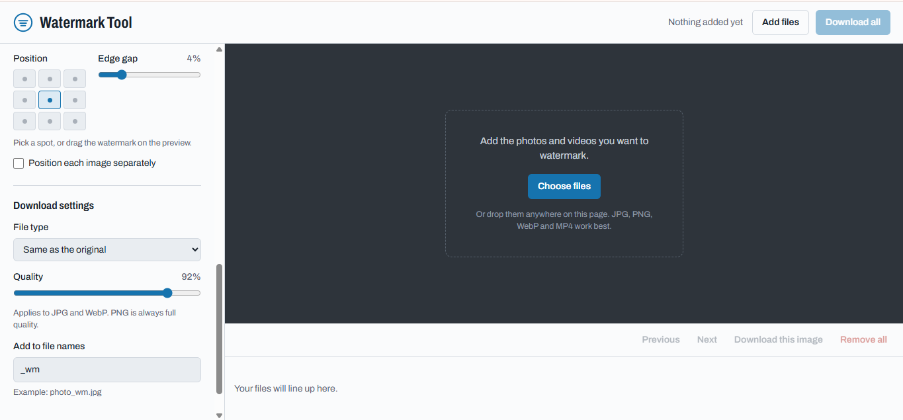

# Batch Watermark

A browser-based tool that batch-watermarks photos and videos: no install, no command line, no backend. Open a link, drop in a folder of media, download the finished set.

Built for a non-technical client running a Telegram news channel who was previously watermarking every photo and video by hand, one file at a time, in separate image and video editors.



## Why this exists

Watermarking a handful of files by hand is fine. Watermarking dozens of them, consistently, every day, is not, and asking a non-technical person to install FFmpeg and run terminal commands isn't a real option. This is a single link that does the whole job in the browser: no software to install, and no server to trust with the files, since nothing is ever uploaded.

## Features

- **Batch upload**, mixed photos and videos in one go, with thumbnails and drag-and-drop
- **Live preview** with drag-to-position, a 9-point placement grid, and per-file or shared positioning
- **Four watermark styles** (round badge, plain text, rounded label, tiled) with full control over font, color, opacity, rotation, and spacing
- **Photo export** to JPG, PNG, or WebP
- **Video export** to MP4 (H.264), with audio preserved and no re-encode where possible
- **Moving watermark** (video only): slides across the frame and off the far edge on a continuous loop, in any of the four cardinal directions, at an adjustable speed. Harder to crop or paint out than a fixed watermark
- **Progress and cancel** for long video jobs, per file and overall
- **Smart downloads**: a ZIP for small batches, straight-to-folder saving for large ones, so a big video batch can't crash the tab
- **Installable** as a lightweight app (PWA): pin it to the taskbar, works offline after first load

## How it works

Both media types share one rendering path. A single `drawWatermark()` function paints the watermark onto any canvas at any resolution:

- For a **photo**, that canvas *is* the exported file.
- For a **video**, the same function renders a full-frame transparent PNG at the clip's exact resolution. [`ffmpeg.wasm`](https://github.com/ffmpegwasm/ffmpeg.wasm) then composites that PNG over the video with an `overlay` filter and re-encodes with `libx264`.

Because one function produces both, the watermark is guaranteed to look identical on a photo and a video, by construction, not by careful tuning of two separate code paths.

The photo tool is a single self-contained HTML file: vanilla JS, no framework, no build step. Video support layers `ffmpeg.wasm` on top, which needs the page served with cross-origin isolation (`Cross-Origin-Opener-Policy` / `Cross-Origin-Embedder-Policy`) to use its fast multi-threaded core. See [`DEPLOY.md`](DEPLOY.md) for why, and what happens when those headers aren't set.

## Try it locally

No dependencies to install for the tool itself. [Node.js](https://nodejs.org) is only used to run a tiny local dev server that sends the right headers.

```bash
node serve.mjs
```

Then open <http://localhost:8080>.

## Deploying

```bash
node build.mjs
```

writes a `dist/` folder containing only what needs to ship. Drag that folder onto [Cloudflare Pages](https://pages.cloudflare.com) (or any static host that lets you set response headers) and you have a URL. Full deployment notes, including why plain GitHub Pages won't work for the video path, are in [`DEPLOY.md`](DEPLOY.md).

## Limits

- Videos over 400 MB are rejected at upload (the browser can't reliably handle more); over 150 MB gets a "this will take a while" warning
- Video processing is one file at a time, with no hard cap on how many files can be queued
- Video encoding is CPU-bound WebAssembly, not hardware-accelerated. Expect it to be slower than a native editor, especially on a phone or an older machine

## Stack

Vanilla JavaScript, HTML5 Canvas, [`ffmpeg.wasm`](https://github.com/ffmpegwasm/ffmpeg.wasm), [JSZip](https://stuk.github.io/jszip/). No framework, no build tooling, no backend.

## License

MIT. See [LICENSE](LICENSE).

